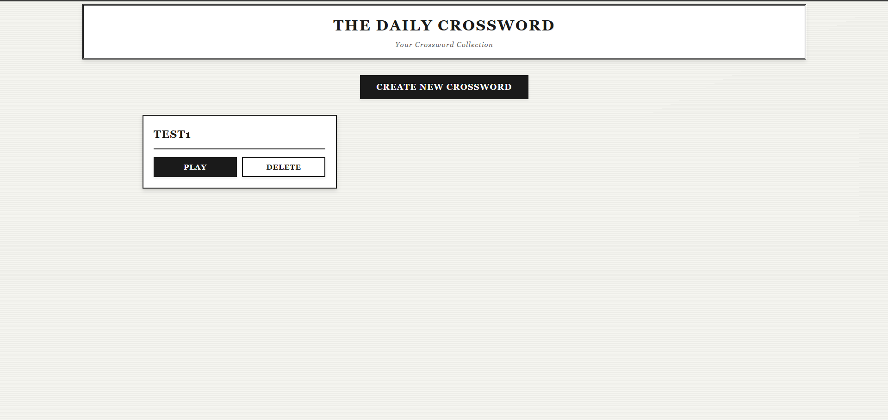
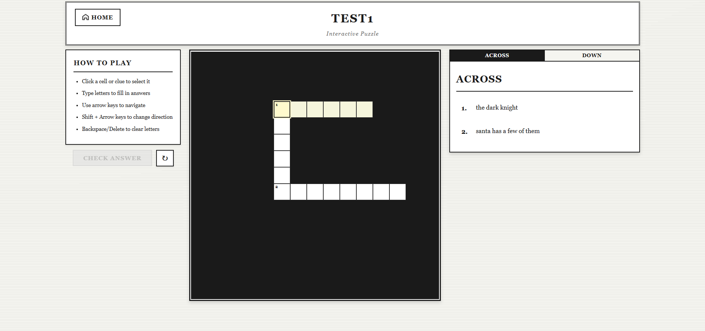
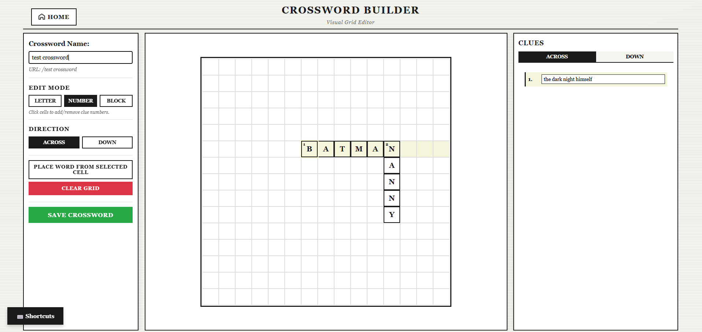

# CrosswordCreator(https://mrmoody098.github.io/CrosswordCreator/) 

Interactive crossword puzzle application built with React. Puzzles are loaded from CSV files.



## Features

- Interactive crossword grid with keyboard input
- Arrow key/cursor navigation
- Crossword builder for creating puzzles
- CSV-based puzzle format



## Crossword Builder

Visual grid editor with three modes: letter entry, clue numbering, and block placement. Supports keyboard shortcuts, multi-cell selection, copy/paste, and automatic numbering. Words can be placed directly or built cell-by-cell. Clues are edited inline and hints are generated automatically from grid letters.




## Setup

Install dependencies:

```bash
npm install
```

Run development server:

```bash
npm run dev
```

Build for production:

```bash
npm run build
```

## Puzzle Format

Puzzles are stored as CSV files in the `public/` folder:
- `grid.csv` - Grid structure and solutions
- `clues.csv` - Clue definitions

See [CROSSWORD_FORMAT.md](./CROSSWORD_FORMAT.md) for format details.

## Local Storage

Crosswords created in the builder are saved to browser local storage. Saved crosswords persist across sessions and can be accessed from the home page.
