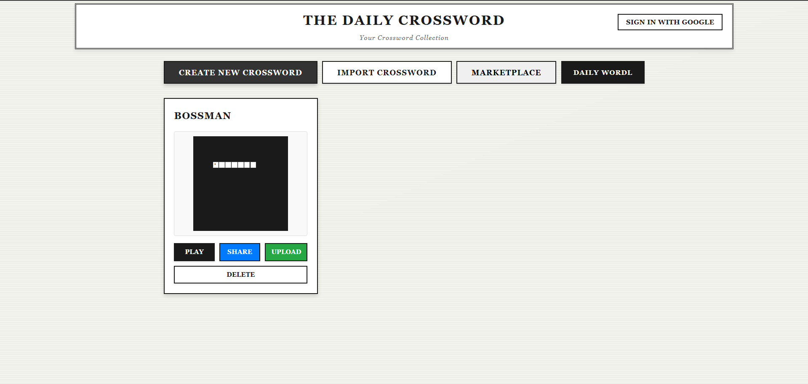
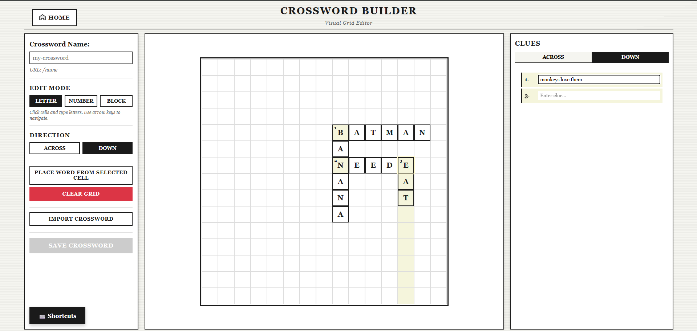
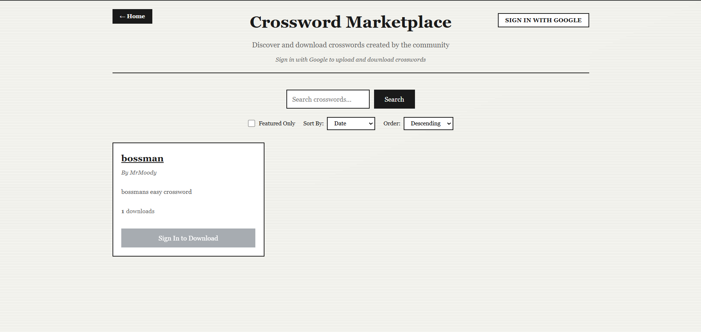
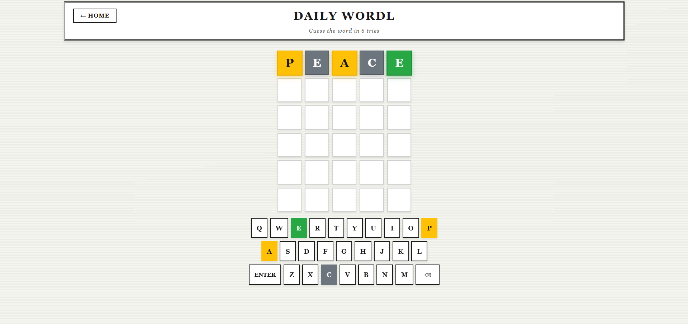

# Crossword Creator

Interactive crossword puzzle application built with React and Vite. Create, solve, and share crossword puzzles with a full-featured visual editor and community marketplace.



## Features

### Interactive Crossword Solver

Play crosswords with an intuitive interface featuring keyboard navigation, real-time validation, and visual feedback. Click cells or clues to navigate, use arrow keys to move between cells, and type letters directly into the grid.


### Visual Crossword Builder

Create custom crosswords with a comprehensive visual editor. The builder includes three modes:



- **Letter Mode**: Type letters directly into cells with automatic navigation
- **Number Mode**: Add clue numbers to word starts with automatic renumbering
- **Block Mode**: Place black squares to define grid structure

Additional builder features include keyboard shortcuts, multi-cell selection, copy and paste functionality, and automatic hint generation from grid letters. Clues are edited inline and saved automatically.

### Marketplace

Browse and download crosswords created by the community. Search by name, filter by featured puzzles, and sort by date, downloads, or rating. Authenticated users can upload their own crosswords to share with others.



### Daily Wordle

Challenge yourself with a daily word-guessing game. Each day features a new five-letter word to guess in six attempts. Track your progress and compete on the leaderboard.



### Sharing and Authentication

Share crosswords via shareable links that can be imported by others. Google OAuth authentication enables marketplace features including uploading, downloading, and managing your published crosswords.

## Setup

Install dependencies:

```bash
npm install
```

Run development server:

```bash
npm run dev
```

Build for production:

```bash
npm run build
```

## Puzzle Format

Puzzles are stored as CSV files:
- Grid CSV: Grid structure and solutions
- Clues CSV: Clue definitions for across and down words

See [CROSSWORD_FORMAT.md](./CROSSWORD_FORMAT.md) for detailed format specifications.

## Storage

Crosswords created in the builder are saved to browser local storage and persist across sessions. Saved crosswords appear on the home page and can be played, shared, or uploaded to the marketplace.